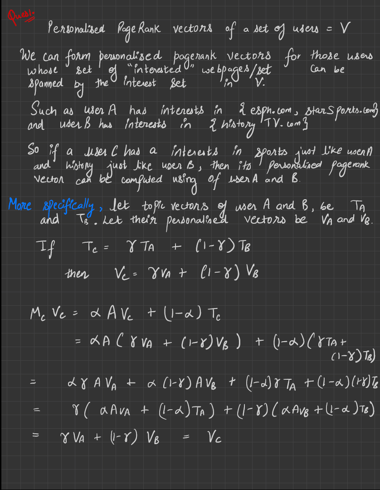
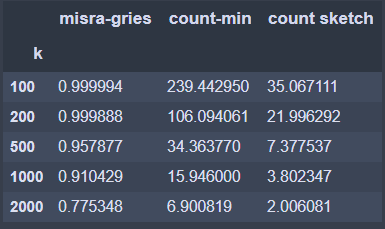
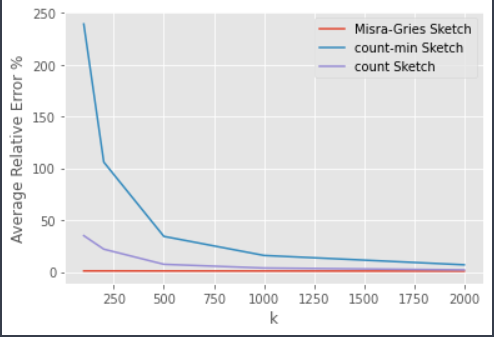

# CS 328 : Homework 2
Sachin Yadav 18110148

### GitHub Link: [https://github.com/yadav-sachin/CS328-Assignment-2](https://github.com/yadav-sachin/CS328-Assignment-2)

## Ques 1.

## Ques 2.

## Ques 3.

## Ques 4.
### File: ques4.ipynb
**Average Relative Error Percentage Table**    

   

**Average Relative Error Plot**

 

## minimum w or k for the average error less than 1%.

**Misra-Gries Sketch**   
    
Min k for 1% average error is: **72**      

**count-min Sketch**
    
Min w for average error < 1% : **2481**    

**Count Sketch**
   
Min w for average error < 1% : **904**   

## Ques 5.
### File : ques5.ipynb

**Low-Rank Approximation**
**Error vs k plot**    
   

**BaseLine Algorithm**    
    
alpha = 0.3678348482223803     
beta = 0.639915746842154

    
    

**Comparison**    
  

